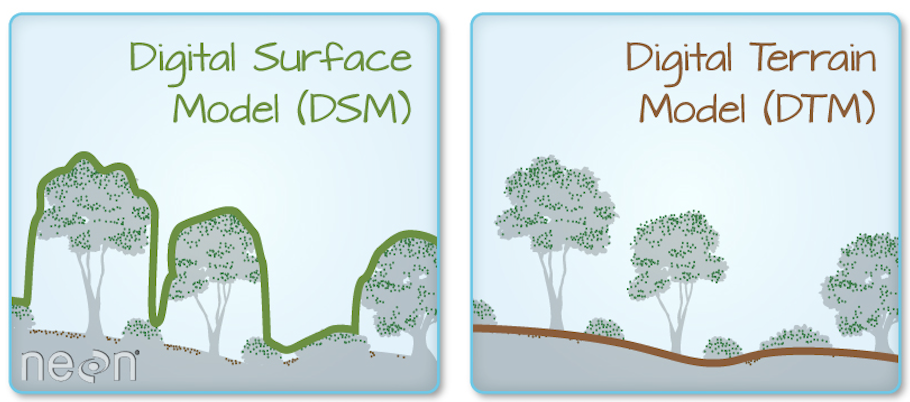

# ISART™ 2024 Tutorial: Building and Evaluating a Statistical Propagation Model

## Introduction

The purpose of this tutorial is to guide you through building your own statistical propagation model based on clutter metrics derived from lidar. Once you've developed your model, you'll compare it with clutter loss predictions from the [ITU-R P.2108](https://github.com/NTIA/p2108) model. Finally, you will assess your model's generalizability against five newly released measurement datasets.

**If you are not an experienced coder, don't worry!** All of the code you will need is provided for you. We invite you to read along with the lessons, run all of the code, and analyze the model outputs. There is much to learn and assessing your model's accuracy on different measurement datasets from different clutter environments is a good place to start.  

**If you do have experience coding, we want you!** We have released five measurement datasets in five different clutter environments. With the release of these datasets we are inviting you to collaborate with ITS on new clutter-based propagation models. Our aim is that the tutorial and code provided here will be a launching point for a collaborative effort on new clutter models. 

The model you'll create in this tutorial was first developed by W. Kozma and M. Cotton in "[A Proposed Mid-band Statistical Clutter Propagation Model Utilizing Lidar Data](https://its.ntia.gov/publications/3367.aspx)," 2023, EuCAP.

## Quick Start

1. **Send your GitHub username to mhollingsworth@NTIA.gov** for access to the course materials and coding environment. Once we receive your email, we will confirm you are an ISART attendee and invite you to the [ISART-2024-tutorial GitHub organization](https://github.com/ISART-2024-tutorial). If you do not have a GitHub account, you can [create one](https://github.com/signup) for free.

2. Once you have been invited, you must accept the invitation to join the GitHub organization. This can be done either from the email you receive, or from your [GitHub organizations tab](https://github.com/settings/organizations) as shown.

   

3. Go to [isart-tutorial.ntia.gov](https://isart-tutorial.ntia.gov) to access your personal JupyterLab instance. Log in with your GitHub account.
   
   JupyterLab is a cloud programming environment that ISART attendees can use for the duration of ISART 2024.

4. Run the lessons.

   All of the course materials are pre-loaded in your JupyterLab instance. Once you've logged in, double click on the `course-materials/` folder to access them. 

   - [**`course-materials/Lesson1.ipynb`**](Lesson1.ipynb) is a quick introduction to using Jupyter Notebooks.

   - [**`course-materials/Lesson2.ipynb`**](Lesson2.ipynb) is on determining clutter metrics from lidar.

   - [**`course-materials/Lesson3.ipynb`**](Lesson3.ipynb) is on building your clutter model.

   - [**`course-materials/Lesson4.ipynb`**](Lesson4.ipynb) is on comparing your clutter model to P.2108.

   - [**`course-materials/Lesson5.ipynb`**](Lesson5.ipynb) is on analyzing your clutter model against measurement data from other clutter environments.

   - [**`course-materials/data/`**](./data) is a directory containing lidar and propagation measurement datasets.

---

## Additional Reading

### JupyterLab

JupyterLab is a web-based coding environment that allows you to work with program files (such as Jupyter Notebooks) and command line terminals. Follow the Quick Start instructions above to have an ISART JupyterLab account created for you. Your JupyterLab account is for you to experiment with and is only accessible to you. Any changes that you make to files will be saved for the next time you log in.

### Jupyter Notebook

A Jupyter Notebook (`.ipynb` file) is an interactive computing document that brings together coding, computation, outputs, explanatory text, and images. Each lesson of this tutorial is contained within a Jupyter Notebook. The `Lesson1.ipynb` notebook contains Python code and explanatory text for executing the code within the notebook.

**How to run your first Jupyter Notebook**

1. Go to [isart-tutorial.ntia.gov](https://isart-tutorial.ntia.gov) to access your personal JupyterLab account.

2. Log in with your GitHub account. If you haven't sent us you're GitHub username, then go back to **Quick Start** and perform step 1.

3. Double click on the `course-materials/` folder on the panel to the left. 

4. Double click on `Lesson1.ipynb`.

   The first cell of Lesson1.ipynb should look like this.

   

   Select this cell and press "Shift-Enter" on the keyboard to execute the code within the cell (alternatively, you can press the "play button" at the top of the page). "Hello, ISART World!" will output just below the cell. You've executed your first bit of Python code.

5. Continue executing the cells in lesson 1 until you reach the end. Now it's time to dive into clutter modeling with lessons 2, 3, and 4. Happy modeling!

### Lidar data

All the lidar data used in this tutorial is provided in the `course-materials/data/` directory. We obtained this lidar data from [OpenTopography](https://opentopography.org). You can create an account for free and download lidar data for your area of interest. 

In these lessons we use lidar data of the `.tif` file type. These `.tif` files are lidar data that has been processed into a raster data format. A raster is a grid of pixels which are all the same size and represent an area on the ground. The rasters in this tutorial have a 1m by 1m resolution, so each pixel represents the elevation of a 1m by 1m area. 

For each location we have two `.tif` files: a Digital Surface Model (DSM), and a Digital Terrain Model (DTM). The DSM contains the elevation of the tallest points in the area, which is often the tops of trees and buildings. The DTM contains the the elevation of the ground. 

Image from [NSF Tutorial "What is a CHM, DSM and DTM? About Gridded, Raster lidar Data" by Leah A. Wasser](https://www.neonscience.org/resources/learning-hub/tutorials/chm-dsm-dtm).

If you would like lidar rasters from areas not included in this tutorial, we recommend using OpenTopography. When downloading data from OpenTopography select GeoTiff as the output format. If available, select Digital Terrain Model and Digital Surface Model to receive both raster layers.

### Measurement data

TODO Link to the github page with the released data.